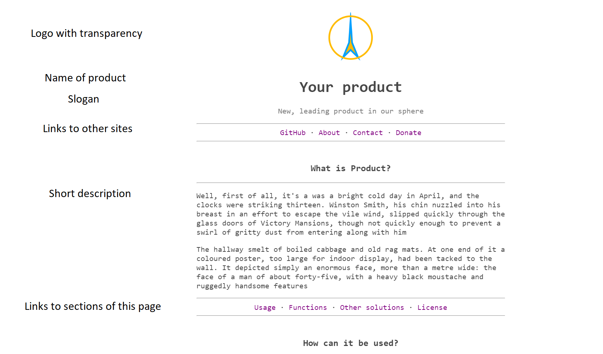
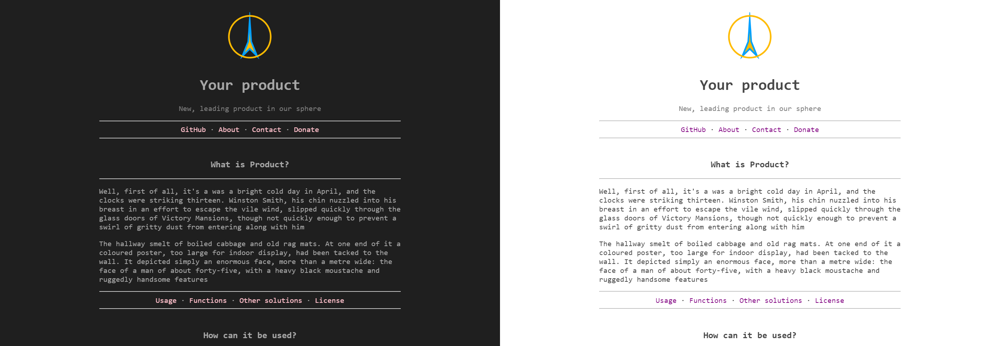
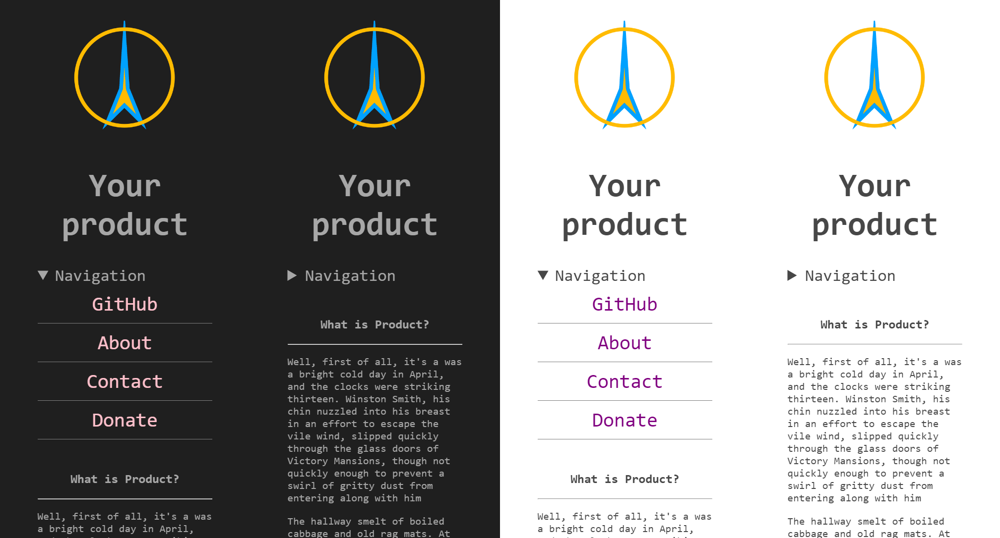

### Concision
A simple template for one-page websites in case if you need 100% control over your website.

### Structure
It is organized in a simple and logical structure.

### Themes
It automatically switches to the appropriate theme chosen by the user, so that they could surf your website any time of day.

### Mobile version
The template is optimized for any kind of device.

You can disable some elements for phone by adding css-class "pc" and disable some elements for pc by adding class "phone".

### How to use
- Fork and change index.html with the content and links you need
- Remove unnecessary folders (e. g. screenshots)
- Go to Settings -> GitHub pages
- Set main as a source and click save
- That's it. It's available under yourusername.github.io/MinimalismSinglePageWebsiteTemplate. Rename the repo or buy a domain to make sure, that your website's domain looks cool.